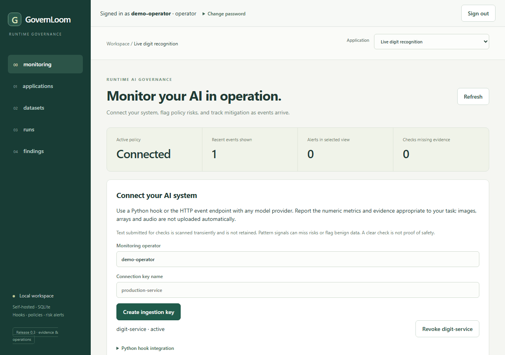
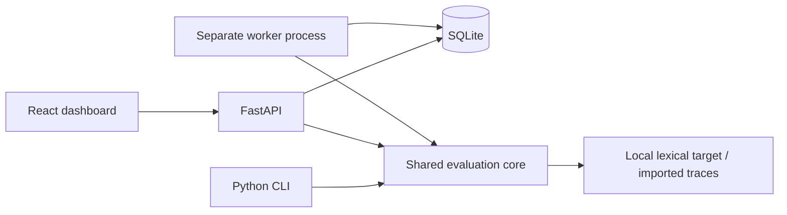

# GovernLoom

[](https://github.com/rahbarahsan/governloom/actions/workflows/checks.yml)

Connect your existing AI system, monitor production signals, flag risks, and
record mitigation decisions. Vision, RAG, forecasting, classification and custom
systems share a provider-independent hook and HTTP event contract.

Release 0.3 adds restart-safe metadata delivery, named operator roles and reviewed
grounding/distribution evidence to scoped keys, live alerts and optional enforcement. Your own model
performs inference; GovernLoom evaluates selected signals without its provider key.
This foundation supports controlled integrations and pilots, with task-specific
checks and explicit gaps.

[Connect a real system](docs/RUNTIME_MONITORING.md) ·
[Product research](docs/PRODUCT_RESEARCH.md) · [Roadmap](docs/ROADMAP.md)

Try the [three actual-model mini applications](examples/README.md): trained digit
recognition, historical NOAA forecasting, and documentation RAG with bounded real
generation. [Measured evidence](docs/TESTBED_EVIDENCE.md),
[delivery and incidents](docs/RUNTIME_DELIVERY.md), and
[private pilot operations](docs/PILOT_OPERATIONS.md) record results and limits.
[Named access](docs/OPERATOR_ACCESS.md), [detector contracts](docs/DETECTOR_EVIDENCE.md)
and [actual detector measurements](docs/DETECTOR_VALIDATION.md) cover the new release.

The earlier RAG workbench remains available for source/dataset review, durable
evaluation jobs and evidence comparison. It does not certify compliance.



25-second Chromium capture of actual held-out digit inference and runtime governance.
RAG scenes replay a recorded real model answer and judgment, explicitly labeled.
Operator actions are scripted demonstrations, not independent human validation.
[Still preview](docs/media/demo-poster.png) · [Capture instructions](docs/media/README.md)
· [Runtime roadmap](docs/ROADMAP.md)

## Run locally

Requirements: Python 3.11+, Node 22.14+ and npm. Launch commands from the
repository root so the API and worker share the same SQLite database.

Windows PowerShell setup:

```powershell
python -m venv .venv
.\.venv\Scripts\python.exe -m pip install -r requirements.lock
.\.venv\Scripts\python.exe -m pip install --no-deps -e ".[dev]"
npm --prefix web ci
```

For monitoring, build the dashboard and start the collector from the root:

```powershell
npm --prefix web run build
.\.venv\Scripts\python.exe -m uvicorn governloom.api:app --host 127.0.0.1 --port 8000
```

Open **http://127.0.0.1:8000**, create an application connection, then use
**Monitoring** to activate a policy and issue a scoped key. Follow the
[integration guide](docs/RUNTIME_MONITORING.md) to wrap your actual callable or
send HTTP events. Monitoring does not require the separate evaluation worker.
For named accounts, bootstrap an administrator and follow [operator access](docs/OPERATOR_ACCESS.md).
Collectors with accounts require sign-in automatically; the local development
workflow remains available on databases without accounts.

For dashboard development and legacy evaluation, use three terminals:

```powershell
# API
.\.venv\Scripts\python.exe -m uvicorn governloom.api:app --host 127.0.0.1 --port 8000
```

```powershell
# Worker
.\.venv\Scripts\python.exe -m governloom.cli worker
```

```powershell
# Dashboard
npm --prefix web run dev
```

Open **http://127.0.0.1:5173**. API schemas are at
**http://127.0.0.1:8000/docs**. Local console/demo need no provider key;
runtime ingestion uses the scoped key you create in Monitoring.

On macOS/Linux, create the same venv and replace
`.\.venv\Scripts\python.exe` with `.venv/bin/python` in those commands.

For a built dashboard, run `npm --prefix web run build` before starting the API;
the API serves it at http://127.0.0.1:8000. Evaluation jobs need the separate worker.
The dashboard is served from the source checkout; Python wheels contain the
hook, collector, evaluation core and fixtures, not the web build.

## Legacy evaluation demo

1. Open **Applications**, then **Load no-key demo** to import fictional Northstar policies and 40
   unreviewed, source-verified repository fixtures. Inspect metric explanations
   and unavailable prerequisites.
2. Open **Datasets**, enter a reviewer name, inspect evidence, and edit, approve
   or reject cases. **Approve remaining** records a bulk decision by that name;
   it does not confer independent validation.
3. **Publish approved dataset**, then **Evaluate v1**. Queue a **clean** run on
   the held-out split. The worker finalizes 20 cases when all fixtures were
   approved. Open findings and unavailable checks.
4. Queue an **invalid citation** run on the same dataset and split. In **Compare
   runs**, select clean as baseline and invalid citation as candidate. Inspect
   changed citation-consistency results and highlighted source passages.
5. Try **outdated source**, **irrelevant retrieval**, **timeout**, and
   **unsupported statement**. The last demonstrates a deliberate blind spot:
   literal agreement can pass an answer with an unsupported extra claim.

Data persists in `data/governloom.db`. Restarts preserve reviews, datasets and
results. For another database, set `GOVERNLOOM_DB` to the same SQLite URL in
both API and worker terminals. Stop both processes before copying the database
and any WAL files for a backup.

The CLI accepts repository fixtures without claiming human review and runs
the same core with all five faults:

```powershell
.\.venv\Scripts\python.exe -m governloom.cli --db sqlite:///data/cli-demo.db demo
.\.venv\Scripts\python.exe -m governloom.cli --db sqlite:///data/cli-demo.db export dataset data/datasets.jsonl
```

Repeat CLI calls create a new frozen version and new runs. Repeated UI demo
loads preserve existing decisions and edits.

## Real-model capture using your ChatGPT subscription

An optional local experiment uses the installed Codex CLI's ChatGPT login to
capture actual model answers, import their traces, and evaluate them through
the existing worker. It also records exploratory claim judgments alongside
the deterministic results. You do not need to share an API key.

First confirm `codex login status` says **Logged in using ChatGPT**. Then run
from the repository root, choosing a model available to your account:

```powershell
.\.venv\Scripts\python.exe scripts/run_subscription_eval.py --allow-subscription --model gpt-6.1-sol --max-requests 8 --output data/my-subscription-capture
```

This explicitly consumes your ChatGPT/Codex allowance: four answer turns and
four judge turns. It rejects API-key authentication, removes API-key overrides
from the child environment, uses a read-only inference workspace, and rejects
captures with tool activity. Each invocation has a 180-second deadline; the
script never retries failed captures. Codex may retry network transport internally.
Normal demo, API, worker, and CI tests make no subscription calls.

The fresh output directory contains `report.json`, per-request prompts, schemas,
responses and usage, and an isolated `workbench.db`. To inspect the two imported
runs in the dashboard, set `GOVERNLOOM_DB` to that database's absolute SQLite URL
before starting the API and worker. No server is started by the capture script.

The target sees only four natural-language questions and two supplied policy
documents. It never sees reference answers or expected case labels. The second
run adds an explicitly synthetic unsupported sentence to two captured answers;
the report distinguishes those controls from observed model outputs.
Claim judgments are uncalibrated estimates in the report, not enabled dashboard
semantic scores. The corpus is fictional, fixture approvals are scripted, and
the sample is exploratory. This demonstrates real inference and exposes the
limits of literal checking; it does not establish production evaluation quality.
See [capture evidence and interpretation](docs/SUBSCRIPTION_EVAL.md).

## Architecture and evidence



Sources retain document identity, immutable versions, SHA-256 hashes and Unicode
passage offsets. Edits create audited case revisions. Publication embeds
approved cases and all source versions in a checksummed snapshot. Runs also
freeze application/model/prompt versions, evaluator definitions, target version,
imported traces, seeded sampling and request limits.

Jobs use atomic SQLite claims, expiring leases, owner fencing, cancellation
checks, and one finalized result per run/case. A killed worker's job can be
reclaimed after its 30-second lease expires. Finalized results are preserved;
an unfinished case may execute again. The local target is read-only; arbitrary
side-effecting target calls are outside this release's scope.

See [measurement rules](docs/MEASUREMENT.md), [schemas/imports](docs/SCHEMAS.md),
[decisions](docs/DECISIONS.md), and [resumable progress](docs/PROGRESS.md).

## Verification

Local checks use Python 3.13.1, Node 22.14.0 and Chromium on Windows. Exact
commands and results are in [release evidence](docs/VALIDATION.md).
[GitHub Actions passed for the v0.2 runtime foundation](https://github.com/rahbarahsan/governloom/actions/runs/37629734622)
on Ubuntu with Python 3.11/3.13 and the Chromium workflow. No deployment occurred.

**49 backend tests and 4 browser workflows pass** for v0.2, along with the
production build, compilation and dependency check. Backend checks include a
real TCP collector/hook integration and enforcement before tool execution.
The earlier fresh-install, wheel and six-run demo evidence is recorded separately.

```powershell
.\.venv\Scripts\python.exe -m pytest -q
.\.venv\Scripts\python.exe -m pip check
npm --prefix web run build
npm --prefix web exec -- playwright install chromium
npm --prefix web run test:e2e
```

Browser tests start an isolated API, worker and dashboard; ports 8000 and 5173
must be free. Each invocation uses a fresh database in `data/` and saves
screenshots under `docs/screenshots/`.

## Scope and limitations

- Runtime monitoring supports any system that sends the selected telemetry.
  Detector coverage depends on task-specific signals; confidence is not accuracy,
  source IDs are not grounding, and text patterns are not comprehensive security.
  Missing evidence remains visible. No universal safety or compliance claim.
- Default loopback binding; private hosting uses named accounts, application roles,
  explicit hosts/origins and TLS. No organization/tenant isolation, SSO or MFA.
  SQLite ingestion is serialized; throughput/availability have not been established.
  Bounded metadata retry survives restarts; automatic retention and external escalation remain future work.
  See [runtime pilot boundaries](docs/RUNTIME_MONITORING.md).
- Legacy workbench: UTF-8 Markdown/text and version 1 JSONL cases/traces. PDF/OCR is deferred.
  Automatic generation requires structured facts; arbitrary prose supports
  manual cases. The target uses lexical retrieval and literal answers, not a
  general language model. Correction scenarios use explicit correction prompts,
  not a stateful conversation agent.
- Legacy fixture citation checks are document-level. Task success checks response behavior.
  Literal agreement misses paraphrases and unsupported additions. Retrieval
  requires supplied relevance labels. Missing latency, usage and prices remain
  unavailable, never zero. Demo timeouts are simulated.
- The fixed 40 fixtures have 20 calibration and 20 held-out cases, grouped by
  topic. Labels are repository-authored template fixtures with automated passage
  checks and no independent human review. Fault results are engineering checks,
  not estimates of general RAG performance.
- Provider protocols and a budgeted integration seam are tested with a fake.
  No paid generation/judge adapter or configuration route is shipped. Legacy
  evaluation grounding remains unavailable; runtime profiles accept separately
  versioned upstream judge evidence. The mini RAG service exercises an opt-in
  bounded subscription adapter with small engineering calibration, whose limits
  and unresolved case are published. Independent human calibration remains needed.
- Next priorities are temporal/domain calibration, durable incident delivery and
  stronger integration tooling. See the [updated roadmap](docs/ROADMAP.md).

Original code and fictional policy material use [Apache-2.0](LICENSE).
See [third-party attribution](docs/THIRD_PARTY.md) for dependencies.
