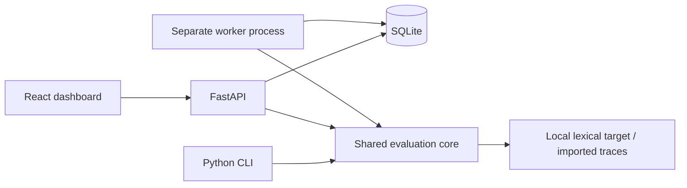

# GovernLoom

Choose meaningful AI metrics, review evidence-backed evaluation datasets, and
inspect failures in a local RAG governance workbench.

Release 0.1 includes a complete no-key workflow: import versioned sources and
traces, review candidates, freeze a dataset, evaluate in a separate durable
worker, inspect source passages, and compare matched runs. It reports separate
measurements and coverage. It does not certify compliance.

## Run locally

Requirements: Python 3.11+, Node 22.14+ and npm. Launch commands from the
repository root so the API and worker share the same SQLite database.

Windows PowerShell setup:

```powershell
python -m venv .venv
.\.venv\Scripts\python.exe -m pip install -r requirements.lock
.\.venv\Scripts\python.exe -m pip install --no-deps -e ".[dev]"
npm --prefix web ci
```

Start these in three terminals, all at the repository root:

```powershell
# API
.\.venv\Scripts\python.exe -m uvicorn governloom.api:app --host 127.0.0.1 --port 8000
```

```powershell
# Worker
.\.venv\Scripts\python.exe -m governloom.cli worker
```

```powershell
# Dashboard
npm --prefix web run dev
```

Open **http://127.0.0.1:5173**. API schemas are at
**http://127.0.0.1:8000/docs**. No credentials or provider calls are needed.

On macOS/Linux, create the same venv and replace
`.\.venv\Scripts\python.exe` with `.venv/bin/python` in those commands.

For a built dashboard, run `npm --prefix web run build` before starting the API;
the API serves it at http://127.0.0.1:8000. Keep the separate worker running.
The dashboard is served from the source checkout; Python wheels contain the
evaluation core and demo fixtures, not the web build.

## One demo

1. Click **Load no-key demo** to import fictional Northstar policies and 40
   unreviewed, source-verified repository fixtures. Inspect metric explanations
   and unavailable prerequisites.
2. Open **Datasets**, enter a reviewer name, inspect evidence, and edit, approve
   or reject cases. **Approve remaining** records a bulk decision by that name;
   it does not confer independent validation.
3. **Publish approved dataset**, then **Evaluate v1**. Queue a **clean** run on
   the held-out split. The worker finalizes 20 cases when all fixtures were
   approved. Open findings and unavailable checks.
4. Queue an **invalid citation** run on the same dataset and split. In **Compare
   runs**, select clean as baseline and invalid citation as candidate. Inspect
   changed citation-consistency results and highlighted source passages.
5. Try **outdated source**, **irrelevant retrieval**, **timeout**, and
   **unsupported statement**. The last demonstrates a deliberate blind spot:
   literal agreement can pass an answer with an unsupported extra claim.

Data persists in `data/governloom.db`. Restarts preserve reviews, datasets and
results. For another database, set `GOVERNLOOM_DB` to the same SQLite URL in
both API and worker terminals. Stop both processes before copying the database
and any WAL files for a backup.

The CLI accepts repository fixtures without claiming human review and runs
the same core with all five faults:

```powershell
.\.venv\Scripts\python.exe -m governloom.cli --db sqlite:///data/cli-demo.db demo
.\.venv\Scripts\python.exe -m governloom.cli --db sqlite:///data/cli-demo.db export dataset data/datasets.jsonl
```

Repeat CLI calls create a new frozen version and new runs. Repeated UI demo
loads preserve existing decisions and edits.

## Architecture and evidence



Sources retain document identity, immutable versions, SHA-256 hashes and Unicode
passage offsets. Edits create audited case revisions. Publication embeds
approved cases and all source versions in a checksummed snapshot. Runs also
freeze application/model/prompt versions, evaluator definitions, target version,
imported traces, seeded sampling and request limits.

Jobs use atomic SQLite claims, expiring leases, owner fencing, cancellation
checks, and one finalized result per run/case. A killed worker's job can be
reclaimed after its 30-second lease expires. Finalized results are preserved;
an unfinished case may execute again. The local target is read-only; arbitrary
side-effecting target calls are outside this release's scope.

See [measurement rules](docs/MEASUREMENT.md), [schemas/imports](docs/SCHEMAS.md),
[decisions](docs/DECISIONS.md), and [resumable progress](docs/PROGRESS.md).

## Verification

Local checks use Python 3.13.1, Node 22.14.0 and Chromium on Windows. Exact
commands and results are in [release evidence](docs/VALIDATION.md). CI definitions
are included; no remote CI execution or deployment is claimed.

**27 backend tests and 3 browser workflows pass**, as do the production build,
fresh Python install, wheel packaging and bundled six-run demo.

```powershell
.\.venv\Scripts\python.exe -m pytest -q
.\.venv\Scripts\python.exe -m pip check
npm --prefix web run build
npm --prefix web exec -- playwright install chromium
npm --prefix web run test:e2e
```

Browser tests start an isolated API, worker and dashboard; ports 8000 and 5173
must be free. Each invocation uses a fresh database in `data/` and saves
screenshots under `docs/screenshots/`.

## Scope and limitations

- Single user, local machine only. Bind to loopback. No accounts, multi-tenancy,
  remote connectors, production instrumentation or regulatory mapping.
- UTF-8 Markdown/text and version 1 JSONL cases/traces. PDF/OCR is deferred.
  Automatic generation requires structured facts; arbitrary prose supports
  manual cases. The target uses lexical retrieval and literal answers, not a
  general language model. Correction scenarios use explicit correction prompts,
  not a stateful conversation agent.
- Citation checks are document-level. Task success checks response behavior.
  Literal agreement misses paraphrases and unsupported additions. Retrieval
  requires supplied relevance labels. Missing latency, usage and prices remain
  unavailable, never zero. Demo timeouts are simulated.
- The fixed 40 fixtures have 20 calibration and 20 held-out cases, grouped by
  topic. Labels are repository-authored template fixtures with automated passage
  checks and no independent human review. Fault results are engineering checks,
  not estimates of general RAG performance.
- Provider protocols and a budgeted integration seam are tested with a fake.
  No paid generation/judge adapter or configuration route is shipped. Semantic
  grounding stays unavailable. Future adapters require explicit caps,
  server-side credentials, pinned rubrics/models and independent calibration.
- A second independent application, a licensed public dataset, real-model
  calibration and broader generalization studies are planned.

Original code and fictional policy material use [Apache-2.0](LICENSE).
See [third-party attribution](docs/THIRD_PARTY.md) for dependencies.
